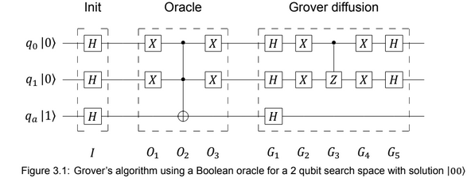

# Distributed Quantum Simulator developed at FEUP

This project is an implementation on a distributed quantum simulator using MPI.
In order to test the results of the instructions, a simpler version of a quantum assembly language was created (myqasm). The simulator takes as input the file name of the quantum assembly code.

## Features

The following operations are implemented:

- Pauli X
- Pauli Y
- Pauli Z
- Hadamard
- Controlled X
- Controlled Z
- Toffoli

## How to Run

Git, gcc, make and openmpi are required

```sh
# Clone this repository
$ git@git.fe.up.pt:quantum-simulator/simulator.git

# Go into the repository
$ cd simulator

# Compile
$ make

# Run
$ mpirun --mca opal_warn_on_missing_libcuda 0 -np <number_of_processes> ./simulator <myqasm_code>
```

## Example with Grovers Algorithm

```sh
mpirun --mca opal_warn_on_missing_libcuda 0 -np 2 ./simulator myqasmTests/q3_grovers.myqasm
```

There is an example of a implementation of the Grovers algorithm using 3 qubits in the myqasmTests folder (q3_grovers.myqasm), alongside many other test examples.  

```
# ---------- Grover's Algorithm in 3 qubits ----------

# Initialize 3 qubit circuit
init 3

# Init
hadamard 0
hadamard 1
hadamard 2

# Oracle
pauliX 0
pauliX 1
toffoli 0 1 2
pauliX 0
pauliX 0

# Grover diffusion
hadamard 0
hadamard 1
hadamard 2
pauliX 0
pauliX 1
controlledZ 0 1
pauliX 0
pauliX 1
hadamard 0
hadamard 1
```  

The code is a representation of the algorithm below:



## Myqasm code syntax
```
init <number_of_qubits>

<operation> [..., <target_qubit>]
```

## Operation Documentation

For pauliX, pauliY, pauliZ and hadamard:

```
<operation> <target_qubit>
```

For controlledX, controlledZ:

```
<operation> <control_qubit> <target_qubit>
```

For toffoli:

```
<operation> <control_qubit1> <control_qubit2> <target_qubit>
```
